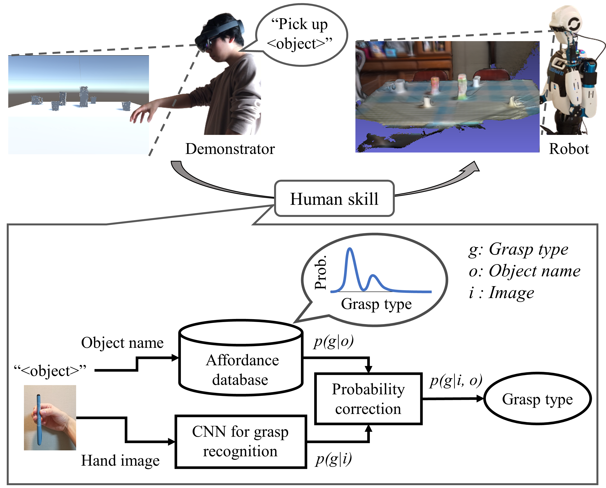

Microsoft Applied Robotics Research Library
# Affordance based grasp-type recognizer

This repository releases the source code for affrdance based grasp-type recognition, which is proposed in the following paper.

- [Object affordance as a guide for grasp-type recognition](https://arxiv.org/abs/2103.00268)  


## Installation:
```bash
pip install . -f https://download.pytorch.org/whl/lts/1.8/torch_lts.html --use-feature=in-tree-build
```
Both CUDA and CPU options are supported. We recommend to use CUDA.

## Usage:
### Recognize a grasp type from an image
```python
from arr_gtr.grasp import GraspTypeRecognitionModule
import numpy as np
from PIL import Image
from arr_gtr.grasp import grasp_types

nn = GraspTypeRecognitionModule()
#nn = GraspTypeRecognitionModule(pretrained_model = <path to a pth model>)

img = np.asarray(Image.open('sample/image.jpg'))
result = nn.inference(img)
print('Inference result: ' + grasp_types[np.argmax(result)])

result = nn.inference_with_affordance(img, 'Apple', affordance_type='varied')
print('Inference result (with varied affordance): ' + grasp_types[np.argmax(result)])

result = nn.inference_with_affordance(img, 'Apple', affordance_type='uniformal')
print('Inference result (with uniformal affordance): ' + grasp_types[np.argmax(result)])
        
result = nn.inference_from_affordance('Apple', affordance_type='varied')
print('Inference result (inference only with varied affordance): ' + grasp_types[np.argmax(result)])

result = nn.inference_from_affordance('Apple', affordance_type='uniformal')
print('Inference result (inference only with uniformal affordance): ' + grasp_types[np.argmax(result)])

```
### Create or pretrain a model
```python
from arr_gtr.grasp import ModelTrainingModule
from arr_gtr.grasp import grasp_types

nn = ModelTrainingModule(<path to a dataset directory>, pretrained_model_path=None, batch_size=512)
nn.train(num_epochs=200, save_path=<path to a pth model e.g., './out/model.pth'>)

nn.visualize_result()
```
## Preparing your own dataset
Expected dataset structure is as follows:  
dataset_path  
├ train  
│  ├ grasp_type (e.g., AdductedThumb)  
│  │  ├ 1.jpg (any name is OK)  
│  │  ├ 2.jpg  
│  │  ├ ...  
├ valid  
│  ├ grasp_type  
│  │  ├ 1.jpg  
│  │  ├ 2.jpg  
│  │  ├ ...  

## Citation:
```
@article{wake2021object,
  title={Object affordance as a guide for grasp-type recognition},
  author={Wake, Naoki and Saito, Daichi and Sasabuchi, Kazuhiro and Koike, Hideki and Ikeuchi, Katsushi},
  journal={arXiv preprint arXiv:2103.00268},
  year={2021}
}
```

Trademarks This project may contain trademarks or logos for projects, products, or services. Authorized use of Microsoft trademarks or logos is subject to and must follow Microsoft’s Trademark & Brand Guidelines. Use of Microsoft trademarks or logos in modified versions of this project must not cause confusion or imply Microsoft sponsorship. Any use of third-party trademarks or logos are subject to those third-party’s policies.
